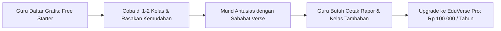

# Rancangan Keuangan & Proyeksi Bisnis SaaS EduVerse
**Model Bisnis:** B2C Teacher-First (Langganan Guru Mandiri)  
**Skema Harga:** Rp 100.000 / Guru / Tahun (~Rp 8.333 / bulan)  
**Target Pasar:** Guru SD, SMP, SMA/SMK di Indonesia (Total Market: ~3,3 Juta Guru)

---

## 1. Analisis Ekonomi Unit (Unit Economics per Guru)

Perhitungan biaya riil (*Cost of Goods Sold / COGS*) yang dikeluarkan sistem untuk melayani 1 orang guru aktif selama 365 hari (1 tahun ajaran penuh):

| Komponen Biaya | Asumsi & Kapasitas | Estimasi Biaya / Guru / Tahun |
| :--- | :--- | :--- |
| **Infrastruktur Database (Supabase)** | Rata-rata 1 guru mengajar 4 kelas (~150 siswa). Total data teks (presensi, nilai, kuis) per guru ~3 MB/tahun. Supabase Pro ($25/bln) menampung jutaan baris data dan ribuan guru. | **Rp 2.500** |
| **Payment Gateway (QRIS / VA)** | Biaya transaksi pembayaran tahunan via Midtrans / Xendit / Tripay (MDR QRIS 0.7% = Rp 700, atau flat VA ~Rp 2.000). Rata-rata fee transaksi: | **Rp 2.000** |
| **Hosting & Web CDN (PWA)** | Cloudflare Pages / Vercel untuk mendistribusikan aset statis PWA (HTML, JS, CSS) dengan edge caching global. | **Rp 500** |
| **TOTAL BIAYA LANGSUNG (COGS)** | **Modal operasional melayani 1 guru per tahun** | **Rp 5.000** |

### Margin Keuntungan Kotor (Gross Profit Margin)
$$\begin{aligned}
\text{Pendapatan per Guru} &= \text{Rp } 100.000 \\
\text{Biaya Langsung (COGS)} &= -\text{Rp } 5.000 \\
\hline
\mathbf{\text{Laba Kotor (Gross Profit)}} &= \mathbf{\text{Rp } 95.000 \quad (\mathbf{95\% \text{ Margin}})}
\end{aligned}$$

---

## 2. Tabel Simulasi Proyeksi Omzet & Laba Bersih

Berikut adalah proyeksi finansial berdasarkan skala adopsi jumlah guru berbayar:

| Fase Bisnis | Jumlah Guru Aktif | Proyeksi Omzet Kotor / Tahun | Estimasi Biaya Server & Gateway | **Estimasi Laba Bersih / Tahun** | Rata-rata Profit Bersih / Bulan |
| :--- | :---: | :---: | :---: | :---: | :---: |
| **Fase 1: Validasi Komunitas** | 100 Guru | Rp 10.000.000 | ~Rp 800.000 *(Supabase Free / Starter)* | **Rp 9.200.000** | ~Rp 766.000 |
| **Fase 2: Adopsi Satu Wilayah** | 500 Guru | Rp 50.000.000 | ~Rp 4.800.000 *(Supabase Pro $25/bln)* | **Rp 45.200.000** | ~Rp 3.760.000 |
| **Fase 3: Jaringan MGMP / KKG** | 1.000 Guru | Rp 100.000.000 | ~Rp 6.000.000 *(Supabase Pro + Compute Add-on)* | **Rp 94.000.000** | ~Rp 7.830.000 |
| **Fase 4: Multi-Kabupaten** | 2.500 Guru | Rp 250.000.000 | ~Rp 12.000.000 *(Supabase Pro Scale)* | **Rp 238.000.000** | ~Rp 19.830.000 |
| **Fase 5: Skala Nasional (Viral)** | 5.000 Guru | Rp 500.000.000 | ~Rp 20.000.000 *(Dedicated Cloud Cluster)* | **Rp 480.000.000** | ~Rp 40.000.000 |
| **Fase 6: Penetrasi Pasar 0.3%** | 10.000 Guru | Rp 1.000.000.000 | ~Rp 42.000.000 *(High Availability DB)* | **Rp 958.000.000** | ~Rp 79.800.000 |

*Catatan: 10.000 guru hanya mewakili **0,3%** dari total 3,3 juta guru di Indonesia.*

---

## 3. Strategi Paket & Fitur (Freemium Model)

Untuk memicu pertumbuhan organik yang cepat tanpa biaya iklan besar (*Product-Led Growth*):



### Rincian Perbandingan Fitur:

| Fitur Aplikasi | Paket Gratis (Free Starter) | Paket Guru Pro (Rp 100.000/Tahun) |
| :--- | :---: | :---: |
| **Maksimal Kelas Aktif** | Maksimal 2 Kelas | **Tanpa Batas (Unlimited Kelas)** |
| **Presensi Cerdas (EduCheck)** | QR Code & Manual | **Face Recognition AI, QR, & Offline-First** |
| **Penilaian (EduScore)** | Formatif & Sumatif Standar | **Kalkulasi Otomatis Kurikulum Merdeka** |
| **Ekspor Rapor & Dokumen** | Format Dasar Excel | **Rapor Siap Cetak PDF + Ekspor Excel Rapih** |
| **CBT Anti-Curang (EduTest)** | Maksimal 5 Ujian Aktif | **Bank Soal & Ujian Online Tanpa Batas** |
| **Gamifikasi EduVerse** | Fitur Dasar Pet Siswa | **Kustomisasi EXP, Pantau Level & Evolusi** |
| **Mode Offline PWA** | Didukung | **Didukung Penuh + Sinkronisasi Otomatis** |
| **Dukungan Bantuan (Support)** | Komunitas / FAQ | **Prioritas WhatsApp Support** |

---

## 4. Keunggulan Nilai Jual (*Value Proposition*) bagi Guru

Mengapa guru akan merasa Rp 100.000/tahun adalah investasi yang sangat murah:
1. **Menghemat ~120 Jam Lembur per Semester**:
   - Merekap nilai harian, formatif, sumatif, dan deskripsi capaian rapor Kurikulum Merdeka biasanya menghabiskan malam-malam guru menjelang pembagian rapor. EduVerse mengkalkulasikannya secara otomatis dalam hitungan detik.
2. **Bebas Kuota Pribadi (Offline-First PWA)**:
   - Guru tidak perlu khawatir kehabisan kuota saat presensi harian di ruang kelas. Aplikasi tetap bekerja tanpa internet dan otomatis tersinkron saat terhubung Wi-Fi.
3. **Meningkatkan Motivasi Belajar Siswa**:
   - Maskot virtual EduVerse (5 elemen) mengubah presensi dan tugas harian menjadi pengalaman bermain yang seru bagi murid.
4. **Metode Bayar Sekali Klik**:
   - Integrasi QRIS (GoPay, OVO, Dana, ShopeePay, Mobile Banking) membuat guru bisa membayar dalam waktu 10 detik langsung dari ponsel mereka.

---

## 5. Rencana Tahapan Peluncuran (Execution Roadmap)

```
[Bulan 1 - 2] Persiapan Peluncuran
├── Finalisasi PWA Slim Notification & Offline Caching
├── Integrasi Payment Gateway (QRIS Otomatis via Midtrans / Tripay)
└── Penerapan Multi-Tenant teacher_id & RLS Security

[Bulan 3 - 4] Beta Testing Tertutup (Target: 50 Guru Pertama)
├── Uji coba di komunitas guru lokal / rekan sejawat
├── Kumpulkan testimoni dan studi kasus waktu lembur yang dihemat
└── Optimasi feedback UI/UX

[Bulan 5 - 8] Peluncuran Publik & Viralitas Komunitas (Target: 500 Guru)
├── Kampanye via komunitas guru WhatsApp & Telegram (KKG / MGMP)
├── Program Referral: "Ajak 3 rekan guru, dapatkan perpanjangan 6 bulan gratis"
└── Publikasi video tutorial singkat (Reels / TikTok Edukasi)

[Bulan 9 - 12] Skalasi Nasional (Target: 2.500+ Guru)
├── EduVerse Expo & Webinar Digitalisasi Kurikulum Merdeka
└── Pembukaan opsi Lisensi Institusi jika sekolah ingin membiayai guru-gurunya
```

---

## 6. Kesimpulan Kelayakan Bisnis

Model bisnis **EduVerse Guru Pro** dengan harga **Rp 100.000 / tahun** memiliki kelayakan finansial yang sangat kuat:
- **Tingkat Margin**: **~95%**, sangat menguntungkan untuk model bisnis SaaS murni.
- **Risiko Kerugian Server**: Hampir 0%, karena biaya server Supabase berbanding lurus dengan jumlah pengguna yang sudah membayar di muka.
- **Hambatan Adopsi**: Sangat rendah, guru tidak perlu menunggu izin kepala sekolah atau dana BOS.
